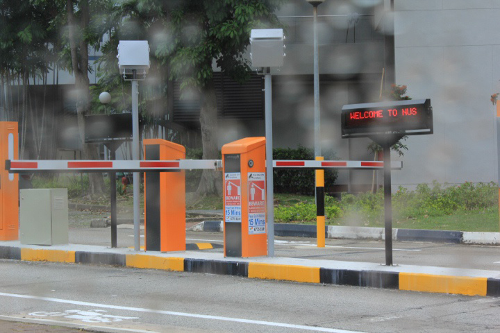
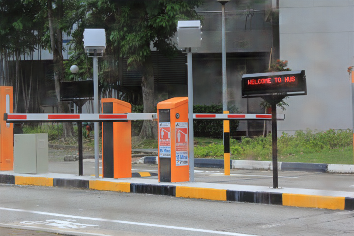

# DerainUNet-MS

A UNet-based deep learning model for image deraindrop removal, implemented using MindSpore.

<div align="center">
  
  
  <p>Before (left) and after (right) rain drop removal</p>
</div>

---

## 🧠 Overview

**DerainUNet-MS** is a deep learning model designed to remove raindrops from images. It is based on the U-Net architecture and implemented using [MindSpore](https://www.mindspore.cn/), a unified AI framework by Huawei.

---

## 🧩 Environment Setup

### ✅ Prerequisites

- Python >= 3.7  
- MindSpore >= 1.8

Follow the [MindSpore installation guide](https://www.mindspore.cn/install) to set up your environment.

### 📦 Additional Dependencies

```bash
pip install numpy pillow scikit-image tqdm
```

---

## 📁 Dataset Preparation

The dataset should follow this directory structure:

```
archive/
├── data/
│   ├── data_train/      # Rainy images (suffix: *_rain.png)
│   └── data_test/       # Test rainy images
└── gt/
    ├── gt_train/        # Ground truth clean images (suffix: *_clean.png)
    └── gt_test/         # Test clean images
```

---

## 🚀 Training

To train the model from scratch or continue training:

```bash
python train.py
```

You can configure training parameters in `train.py`:

- `data_dir`: Path to the dataset  
- `batch_size`: Number of images per batch  
- `num_epochs`: Total number of epochs  
- `learning_rate`: Initial learning rate  
- `weight_decay`: Weight decay for Adam optimizer  

The best model will be saved as `unet_best.ckpt` based on PSNR performance on the test set.

---

## 🧪 Testing

To test the model with your own images:

1. Place your input images in the `imgs/` folder.
2. Run the test script:

```bash
python test.py
```

Results will be saved in the `results/` folder.

You can modify paths in `test.py` as needed:

- `model_path`: Path to the trained `.ckpt` file  
- `input_dir`: Directory of input images  
- `output_dir`: Directory to save output images  

---

## 🏗️ Model Architecture

The DerainUNet model is structured as follows:

- **Encoder**: 4 double convolution blocks  
- **Bottleneck**: Middle processing layer  
- **Decoder**: 4 upsampling blocks using transpose convolutions and double convs  
- **Skip Connections**: Between encoder and decoder at each resolution level  

This design preserves spatial features while learning abstract representations of raindrop patterns.

---

## 📜 License

This project is licensed under the MIT License.

---

Feel free to contribute or raise issues for improvement!
